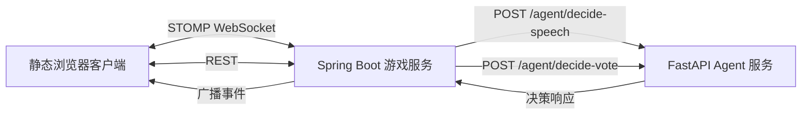

# 卧底游戏设计文档

## 目标

构建一个可端到端游玩的 MVP 网页版社交推理游戏。2-8 名真人玩家进入同一个房间，以匿名身份聊天，并在每轮投票中尝试找出隐藏在玩家中的 AI。第一版前端以简约静态页面为主，重点先跑通房间、聊天、投票、淘汰、胜负和 Java 调 Python Agent 的核心闭环。

AI 实现先保持轻量：Java 控制游戏时机、上下文和广播，Python FastAPI 服务只通过稳定接口返回“是否发言、发言内容、投票目标”等决策。

## 产品范围

MVP 包含：

- 无账号的房间创建和房间码加入。
- 房主控制开始游戏。
- 开局时分配匿名身份，只展示序号和颜色。
- 默认 1 名 AI 玩家。
- 一个公开主题，加上每轮公开引导问题。
- 实时聊天、系统事件、轮次计时、投票、淘汰和游戏结束。
- Python Agent 服务边界，用于发言决策和投票决策。
- 仅内存存储。

MVP 不包含：

- 登录、持久化、复盘、内容审核、超出当前房间状态的历史恢复、精致视觉设计、真正的 LangChain 推理。
- 多 AI 作为第一版可配置玩法，但胜负逻辑和身份结构要预留扩展空间。

## 架构



Spring Boot 是房间、玩家、聊天状态、计时器、投票、淘汰和胜负判断的唯一事实来源。它负责决定什么时候调用 Python，并校验 Python 返回的所有决策。

Python FastAPI 暴露 Agent 边界。第一版可以返回简单固定值或随机值。后续 Python 内部可以替换成 LangChain Agent，而不需要改变 Java 的游戏主流程。

## 游戏规则

玩家通过房间码创建或加入房间。至少 2 名真人玩家加入后，房主可以开始游戏。第一版支持 2-8 名真人玩家，开局时自动加入 1 名 AI 玩家。

游戏开始前，等待房间只显示玩家数量。游戏开始时，服务端给每个参与者分配唯一的序号和颜色，AI 也一样。界面不展示真人昵称。

每一轮包含：

1. 一个公开主题和一个公开引导问题。
2. 5 分钟聊天阶段。
3. 投票阶段。
4. 结算投票、淘汰玩家、检查胜负。

AI 知道公开主题和引导问题。它的目标是自然参与聊天，并隐藏自己是 AI。MVP 模式是“AI 伪装”模式，不是传统的错词卧底模式。身份和知识结构要为后续玩法预留空间，例如错误主题、无主题、多 AI、真人卧底等。

如果 AI 在达成 AI 胜利条件前被投票淘汰，真人胜利。投票结算后，如果至少 1 名 AI 存活，并且存活 AI 数量大于等于存活真人数量，则 AI 胜利。MVP 只有 1 名 AI，因此 `1 真人 + 1 AI` 时 AI 胜利。

如果被投出的是真人，并且存活真人数量仍然大于存活 AI 数量，则游戏进入下一轮。

如果投票平票，则从最高票候选人中随机淘汰 1 人，保证流程继续推进。

## AI 行为边界

Java 负责触发时机和上下文打包。它会在人类玩家发言后、冷场定时器触发时调用发言接口。Python 只决定是否发言以及说什么。

发言响应：

```json
{
  "shouldSpeak": true,
  "message": "I think this topic is easier to discuss through everyday examples."
}
```

投票阶段，Java 把候选人和近期聊天上下文发送给 Python。Python 返回 AI 的投票目标。

投票响应：

```json
{
  "targetPlayerId": "player-3",
  "reason": "This player sounds like they are probing others more than sharing."
}
```

Java 只使用 `targetPlayerId` 计票。`reason` 在 MVP 中仅用于日志和调试，不广播给玩家。

如果 Python 不可用、超时或返回非法数据，Java 要保证游戏继续运行。发言决策失败时，本次不产生 AI 消息。投票决策失败时，Java 使用兜底策略，从合法真人目标中随机选择 1 人。

## 后端设计

建议的 Spring Boot 模块：

- `room`：房间 REST API、生命周期、房主权限、内存房间仓库。
- `game`：开局、轮次计时器、投票结算、淘汰、胜负策略。
- `chat`：WebSocket 聊天处理、消息保存、事件广播、AI 发言触发。
- `agent`：Python Agent 服务 HTTP 客户端、响应校验、兜底处理。
- `topic`：公开主题和引导问题选择。
- `web`：静态前端资源。

核心模型：

```text
Room
- roomCode
- status: WAITING / CHATTING / VOTING / ENDED / DESTROYED
- hostPlayerId
- players
- currentRound
- topic
- prompts
- messages
- votes

Player
- id
- token
- number
- color
- type: HUMAN / AI
- alive
- host

ChatMessage
- id
- roomCode
- senderPlayerId
- senderNumber
- senderColor
- content
- createdAt
- aiGenerated

Vote
- voterPlayerId
- targetPlayerId
- roundNumber
```

房间仓库只存内存。Java 服务重启后，所有房间都会清空。

房主离开会销毁房间。为了避免房主刷新页面时误销毁房间，主动点击离开会立即销毁；WebSocket 断开可以设置一个短暂宽限期。如果房主没有在宽限期内使用同一个 `playerToken` 重连，服务端广播 `ROOM_DESTROYED` 并移除房间。

## API 设计

REST:

```http
POST /api/rooms
POST /api/rooms/{roomCode}/join
POST /api/rooms/{roomCode}/start
POST /api/rooms/{roomCode}/leave
GET  /api/rooms/{roomCode}/snapshot
```

创建或加入房间时，服务端返回 `playerToken`。浏览器把它存入 `localStorage`，后续 REST 请求和 WebSocket 消息都携带该 token。

WebSocket/STOMP:

```text
Connect:
  /ws

Client sends:
  /app/rooms/{roomCode}/chat
  /app/rooms/{roomCode}/vote

Client subscribes:
  /topic/rooms/{roomCode}/events
```

事件类型包括：

- `PLAYER_JOINED`
- `PLAYER_LEFT`
- `ROOM_DESTROYED`
- `GAME_STARTED`
- `TOPIC_PROMPT`
- `CHAT_MESSAGE`
- `VOTING_STARTED`
- `VOTE_UPDATED`
- `PLAYER_ELIMINATED`
- `ROUND_STARTED`
- `GAME_ENDED`
- `ERROR`

## 前端设计

前端是由 Spring Boot 托管的单个静态页面，使用原生 HTML、CSS 和 JavaScript。

页面状态：

- 大厅：创建房间或输入房间码加入。
- 等待房间：显示房间码、玩家数量、仅房主可见的开始按钮。
- 游戏中：显示房间码、轮次、倒计时、阶段、存活玩家列表、当前引导问题、聊天区、消息输入框和投票面板。
- 结束或销毁：显示游戏结果或房间已销毁提示。

视觉风格保持简约和功能优先。玩家颜色用于身份识别，其余界面保持克制，避免抢占游戏信息的注意力。

聊天阶段启用消息输入框。投票阶段禁用聊天，并显示存活候选人的投票按钮。玩家投票后，界面只显示“已提交投票”，不公开其投票对象。

## 错误处理

MVP 需要处理：

- 房间码无效：返回友好错误。
- 加入已开始或已结束房间：拒绝。
- 真人少于 2 人时开始游戏：拒绝。
- 非房主请求开始游戏：拒绝。
- 同一玩家在同一轮重复投票：MVP 直接拒绝。
- 投给已淘汰或未知玩家：拒绝。
- 已淘汰玩家发言，或投票阶段发言：拒绝。
- Agent 发言失败：跳过本次 AI 消息。
- Agent 投票失败：使用合法兜底目标。
- 房主主动离开，或房主断线宽限期过期：销毁房间。

## 测试策略

Java 测试应覆盖：

- 房间创建、加入、开始权限和开始条件。
- 匿名序号和颜色分配。
- 聊天校验和事件构造。
- 投票提交和重复投票处理。
- 平票结算。
- 胜负策略：真人胜、`aliveAi >= aliveHuman` 时 AI 胜、继续游戏。
- Python 不可用或返回非法数据时的 Agent 兜底。
- 房主离开导致房间销毁。

Python 测试应覆盖：

- `decide-speech` 响应结构。
- `decide-vote` 响应结构。
- 当存在候选人时，MVP 简单实现返回合法目标。

## 实现注意事项

第一版实现要保持文件小、边界清楚。Python 服务是一个可替换的 Agent 外壳，还不是智能层本身。Java 服务不能盲信 Agent 输出：广播或计票前必须校验文本长度、消息非空、玩家 ID 是否存在，以及投票目标是否合法。
