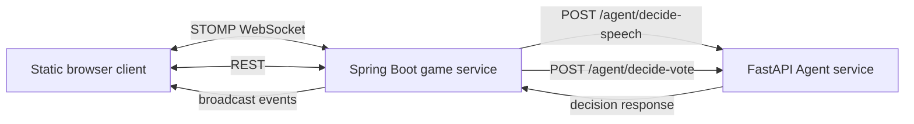

# Deep Cover Game Design

## Goal

Build an MVP web version of a social deduction game where 2-8 human players enter a room, chat anonymously, and vote every round to identify the hidden AI player. The first version should be playable end to end with a simple static frontend. The AI implementation is intentionally thin: Java controls game timing and context, while a Python FastAPI service returns speech and vote decisions through stable interfaces.

## Product Scope

The MVP includes:

- Room creation and room-code joining without accounts.
- A host-controlled start flow.
- Anonymous player identities assigned at game start: number plus color only.
- One AI player by default.
- A public theme plus recurring public prompt questions.
- Real-time chat, system events, round timers, voting, elimination, and game end.
- A Python Agent service boundary for speech and vote decisions.
- In-memory storage only.

The MVP excludes:

- Login, persistence, replay, moderation, reconnect history beyond current room state, polished visual design, and real LangChain reasoning.
- Multiple AI players as a playable setting, though win logic and role structures should leave room for it.

## Architecture



Spring Boot is the source of truth for rooms, players, chat state, timers, voting, elimination, and win checks. It decides when to call Python and validates all returned decisions.

Python FastAPI exposes the Agent boundary. The first version can return simple fixed or random values. Later, the internal Python implementation can become a LangChain Agent without changing the Java game flow.

## Game Rules

Players create or join a room by room code. The host can start once at least 2 human players have joined. The first version supports 2-8 human players and automatically adds 1 AI player when the game starts.

Before the game starts, the room shows only the waiting list count. At game start, the server assigns every participant, including the AI, a unique number and color. The UI never shows human nicknames.

Each round has:

1. A public theme and one public prompt question.
2. A 5-minute chat phase.
3. A voting phase.
4. Vote settlement, elimination, and win check.

The AI knows the public theme and prompt. Its goal is to participate naturally and hide that it is AI. The MVP mode is an "AI disguise" mode, not a traditional wrong-word undercover mode. The role and knowledge model should leave room for later modes such as wrong theme, no theme, multiple AIs, or human undercover roles.

Humans win if the AI is voted out before the AI win condition is reached. The AI wins if, after a vote is settled, at least one AI is alive and the number of alive AIs is greater than or equal to the number of alive humans. With the MVP's single AI, this means `1 human + 1 AI` is an AI win.

If a human is voted out and alive humans still outnumber alive AIs, the game continues to the next round.

Ties are resolved by randomly eliminating one of the highest-voted candidates so the round always advances.

## AI Behavior Boundary

Java is responsible for trigger timing and context packaging. It calls the speech endpoint after human chat messages and on idle/cold-start timers. Python decides only whether to speak and what to say.

Speech response:

```json
{
  "shouldSpeak": true,
  "message": "I think this topic is easier to discuss through everyday examples."
}
```

During voting, Java sends the candidates and recent chat context to Python. Python returns the AI vote.

Vote response:

```json
{
  "targetPlayerId": "player-3",
  "reason": "This player sounds like they are probing others more than sharing."
}
```

Java uses `targetPlayerId` for vote counting. The `reason` is kept for logs and debugging in the MVP and is not broadcast to players.

If Python is unavailable, times out, or returns invalid data, Java keeps the game moving. Failed speech decisions produce no AI message. Failed vote decisions fall back to a legal random human target.

## Backend Design

Recommended Spring Boot modules:

- `room`: room REST APIs, lifecycle, host permissions, and in-memory repository.
- `game`: game start, round timers, voting settlement, elimination, and win policy.
- `chat`: WebSocket chat handling, message storage, broadcast events, and AI speech triggers.
- `agent`: HTTP client for Python Agent service, response validation, and fallback handling.
- `topic`: public theme and prompt selection.
- `web`: static frontend assets.

Core models:

```text
Room
- roomCode
- status: WAITING / CHATTING / VOTING / ENDED / DESTROYED
- hostPlayerId
- players
- currentRound
- topic
- prompts
- messages
- votes

Player
- id
- token
- number
- color
- type: HUMAN / AI
- alive
- host

ChatMessage
- id
- roomCode
- senderPlayerId
- senderNumber
- senderColor
- content
- createdAt
- aiGenerated

Vote
- voterPlayerId
- targetPlayerId
- roundNumber
```

The room repository is memory-only. Restarting the Java service clears rooms.

Host leaving destroys the room. To avoid accidental destruction on a browser refresh, explicit host leave destroys immediately, while WebSocket disconnect can use a short grace period. If the host does not reconnect with the same `playerToken` during that grace period, the server broadcasts `ROOM_DESTROYED` and removes the room.

## API Design

REST:

```http
POST /api/rooms
POST /api/rooms/{roomCode}/join
POST /api/rooms/{roomCode}/start
POST /api/rooms/{roomCode}/leave
GET  /api/rooms/{roomCode}/snapshot
```

The server returns a `playerToken` on create or join. The browser stores it in `localStorage` and sends it on later requests and WebSocket messages.

WebSocket/STOMP:

```text
Connect:
  /ws

Client sends:
  /app/rooms/{roomCode}/chat
  /app/rooms/{roomCode}/vote

Client subscribes:
  /topic/rooms/{roomCode}/events
```

Event types include:

- `PLAYER_JOINED`
- `PLAYER_LEFT`
- `ROOM_DESTROYED`
- `GAME_STARTED`
- `TOPIC_PROMPT`
- `CHAT_MESSAGE`
- `VOTING_STARTED`
- `VOTE_UPDATED`
- `PLAYER_ELIMINATED`
- `ROUND_STARTED`
- `GAME_ENDED`
- `ERROR`

## Frontend Design

The frontend is a single static page served by Spring Boot. It uses plain HTML, CSS, and JavaScript.

States:

- Lobby: create room or join by room code.
- Waiting room: show room code, player count, and a host-only start button.
- Game: show room code, round, countdown, phase, alive player list, current prompt, chat, message input, and voting panel.
- Ended/destroyed: show result or room destroyed message.

The visual style should be minimal and functional. Player colors are used for identity; the rest of the UI stays restrained so it does not compete with the game information.

During chat, the message input is enabled. During voting, chat is disabled and the vote panel shows alive candidates. After a player votes, the UI shows that their vote was submitted without revealing who they voted for.

## Error Handling

The MVP should handle:

- Invalid room code: return a friendly error.
- Joining a started or ended room: reject.
- Start with fewer than 2 humans: reject.
- Non-host start request: reject.
- Duplicate vote by same player in same round: reject or replace consistently; MVP should reject.
- Vote for eliminated or unknown player: reject.
- Chat from eliminated player or during voting: reject.
- Agent speech failure: skip AI message.
- Agent vote failure: use legal fallback target.
- Host leave or expired host disconnect grace period: destroy room.

## Testing Strategy

Java tests should cover:

- Room creation, join, start permissions, and start conditions.
- Anonymous number and color assignment.
- Chat validation and event construction.
- Vote submission and duplicate vote handling.
- Tie settlement.
- Win policy for human win, AI win at `aliveAi >= aliveHuman`, and continue cases.
- Agent fallback when Python is unavailable or invalid.
- Host leave room destruction.

Python tests should cover:

- `decide-speech` response schema.
- `decide-vote` response schema.
- A legal target is returned by the simple MVP implementation when candidates are provided.

## Implementation Notes

The first implementation should keep files small and boundaries clear. The Python service is a replaceable Agent shell, not the intelligence layer yet. The Java service should never trust Agent output blindly: validate text length, non-empty messages, valid player IDs, and legal vote targets before broadcasting or counting anything.
